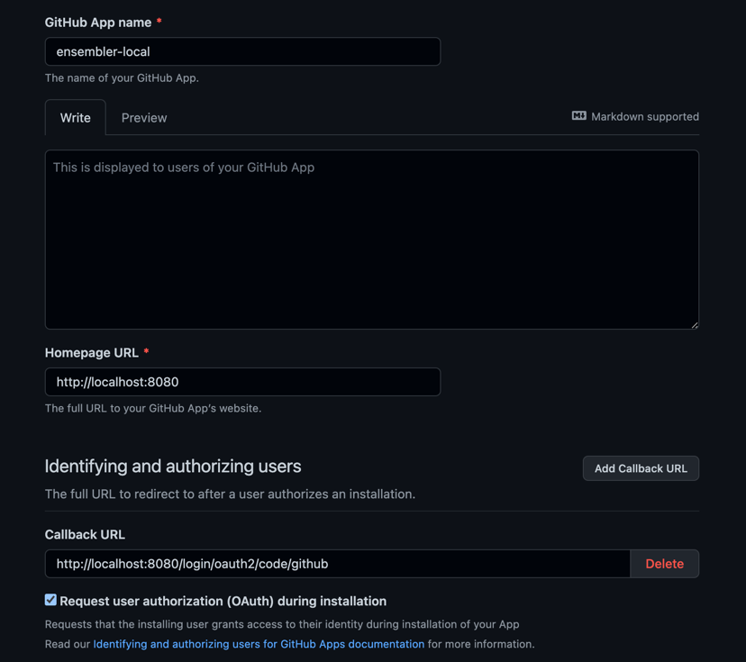

Create an app

https://github.com/settings/apps

- generate a secret
- Homepage URL : http://localhost:8080
- Callback URL : http://localhost:8080/login/oauth2/code/github
- Check :  Request user authorization (OAuth) during installation
- Uncheck : Webhook

